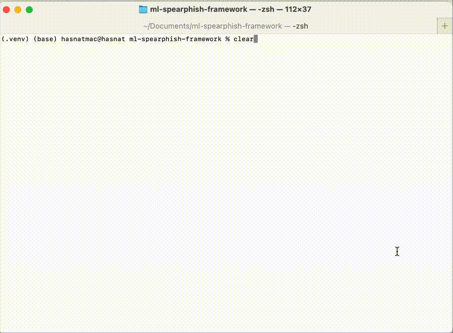

**Tech stack:** FastAPI · XGBoost/TensorFlow · SHAP · Docker · GitHub Actions
[](LICENSE) 
[](https://www.docker.com/) 
[](https://www.python.org/) 
[](https://fastapi.tiangolo.com/)
# 🛡️ ML Spear-Phishing Detection Framework

An intelligent, multi-phase spear-phishing detection system designed for cybersecurity integration, commercial readiness, and MLOps monitoring. This project combines traditional ML, explainable AI, real-time APIs, and production observability tools.

---

## 🚀 Project Overview

This project implements a hybrid ML system to detect spear-phishing emails using:

- TF-IDF vectorization & engineered features
- XGBoost and CNN (TensorFlow) models
- SHAP & LIME for explainability
- FastAPI for inference and feedback loop
- Prometheus + Grafana for monitoring
- Streamlit / Gradio UI (upcoming)
- Redis + RQ for async background tasks
- Dockerized deployment

---

## 🧠 Multi-Phase Roadmap

### ✅ Phase 1: MVP + CNN  
Core model built using **TensorFlow** with **Conv1D** layers and tuned with **Keras Tuner**.

### ✅ Phase 2: Model Explainability (SHAP, LIME)  
**SHAP** and **LIME** integrated for local and global explainability with comparison plots.

### ✅ Phase 3: Real-Time Prediction API (FastAPI)  
Asynchronous **FastAPI** app with **Redis + RQ**, supporting `/predict`, `/feedback`, and `/explain` endpoints, with **SQLite** logging.

### 🔜 Phase 4: Streamlit / Gradio Dashboard  
User-facing dashboard for real-time predictions, visual insights, and feedback loop.

### 🔜 Phase 5: Monitoring + Logging (Prometheus, Grafana)  
Metrics collection, visual dashboards, and performance monitoring for **MLOps observability**.

### 🔜 Phase 6: Dockerization + GitHub Actions CI/CD  
Containerization, deployment automation, and **GitHub Actions** for production readiness.

## 🧠 Multi-Phase Roadmap

- ✅ Phase 1: MVP + CNN  
Core model built using **TensorFlow** with **Conv1D** layers and tuned with **Keras Tuner**.
- ✅ Phase 2: Model Explainability (SHAP, LIME)  
**SHAP** and **LIME** integrated for local and global explainability with comparison plots.
- ✅ Phase 3: Real-Time Prediction API (FastAPI)  
Asynchronous **FastAPI** app with **Redis + RQ**, supporting `/predict`, `/feedback`, and `/explain` endpoints, with **SQLite** logging.
- ✅ Phase 4: Streamlit / Gradio Dashboard  
User-facing dashboard for real-time predictions, visual insights, and feedback loop.
- ✅ Phase 5: Monitoring + Logging (Prometheus, Grafana)  
Metrics collection, visual dashboards, and performance monitoring using **Prometheus + Grafana**.
- ✅ Phase 6: Dockerization + GitHub Actions CI/CD  
Fully containerized with **Docker**, plus deployment automation using **GitHub Actions** (if implemented).


---

## 🧰 Libraries & Tools

| Purpose                  | Libraries / Tools                                                                 |
|--------------------------|-----------------------------------------------------------------------------------|
| Core ML / DL             | TensorFlow, Keras, XGBoost, scikit-learn                                          |
| Hyperparameter Tuning    | Keras Tuner                                                                       |
| Model Explainability     | SHAP, LIME                                                                         |
| Feature Engineering      | TF-IDF, Pandas, NumPy                                                              |
| API Development          | FastAPI, Flask, HTTPX                                                              |
| Dashboard UI             | Streamlit, Gradio                                                                 |
| Monitoring & Observability | Prometheus, Grafana, python-json-logger                                         |
| Data Visualization       | Seaborn, Matplotlib, WordCloud                                                    |
| Async Processing         | Redis, RQ                                                                          |
| Deployment & DevOps      | Docker, GitHub Actions (planned), VS Code, Gunicorn                              |
| Jupyter Ecosystem        | JupyterLab, IPython, nbconvert, widgets                                           |

---

## 📦 Folder Structure

Run this to generate:
```bash
tree -I '__pycache__|venv|.git' -L 3 > structure.txt
```

📄 [`structure.txt`](structure.txt)

---

## 📈 Prometheus Metrics

The API exposes Prometheus-compatible metrics at `http://localhost:8000/metrics`:

- `phishing_predictions_total`: Counter for prediction attempts

Visualized in Grafana via Prometheus query:
```prometheus
phishing_predictions_total
```

---

## 📊 Monitoring Stack with Docker Compose

Prometheus and Grafana are launched via `docker-compose.monitoring.yml`:

```yaml
services:
  prometheus:
    image: prom/prometheus:latest
    ports:
      - "9090:9090"
    volumes:
      - ./monitoring/prometheus.yml:/etc/prometheus/prometheus.yml

  grafana:
    image: grafana/grafana:latest
    ports:
      - "3001:3000"
```

Launch the stack:

```bash
docker-compose -f docker-compose.monitoring.yml up -d
```

- **Prometheus UI**: [http://localhost:9090](http://localhost:9090)  
- **Grafana UI**: [http://localhost:3001](http://localhost:3001)  
  Default credentials: `admin` / `admin`

---

## 🧪 Example Usage

POST a phishing email to the API:

```
POST http://localhost:8000/predict
Content-Type: application/json

{
  "text": "Dear user, your account has been compromised. Please login now."
}
```

---

## 🔒 Security Vision

This framework is a prototype for a self-improving, explainable, and production-ready spear-phishing detection system. Future enhancements include automated threat response and SaaS integration.

---

## 👨‍💻 Maintainer

**A. Ahsan (HABIB)** — Data Engineering & Cybersecurity Enthusiast  
[GitHub Profile](https://github.com/your-username) | [LinkedIn](https://linkedin.com/in/your-link)

---

_Last updated: August 2025_
---

## Quickstart (demo)

Quick 5-minute demo to run locally:

```bash
# clone & start (one-time)
git clone https://github.com/Habib-AAhsan/ml-spearphish-framework.git
cd ml-spearphish-framework

# start demo (creates virtualenv, installs deps, generates toy data and runs server)
make demo

# in another terminal, test the endpoint
curl -s -X POST "http://127.0.0.1:8000/predict" -H "Content-Type: application/json" -d @data/toy.json | jq
```

## Quick demo (visual)

Run the demo locally (see Quickstart above) — or preview:



*Demo: generate toy data → call `/predict` → get scores (local)*

**Interpretation:** score > 0.7 ⇒ likely spear-phish (tune threshold for your dataset)

## Run with Docker (alt)

```bash
# build image
docker build -t spearphish-demo .

# run container
docker run -p 8000:8000 spearphish-demo

# test endpoint
curl -s -X POST "http://127.0.0.1:8000/predict" \
  -H "Content-Type: application/json" \
  -d @data/toy.json | jq


**How scores are interpreted**

score > 0.7 ⇒ likely spear-phish (tune threshold to your data).
